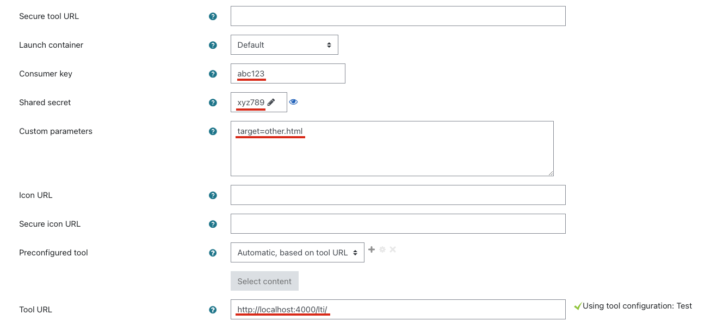

# LTI Provider Example for multiple Content

LTI provider using NodeJS to deliver multiple content across different keys with the option to return results depending on which key was used in the LTI consumer.

## Usage

Place new content in `public` folder or use `example`. Create at least one consumer for this content with cli:

```
~$ npm run cli -- create example
```

This will create a content key and secret, for example:

```text
lti-provider:cli New consumer for example created.
lti-provider:cli   Key = abc123
lti-provider:cli   Secret = xyz789
```

Afterwards go (for example) to Moodle and add an external tool. Use `http://localhost:4000/lti` (or public domain) as Tool URL. Enter Key and Secret. In case of accessing `other.html` use `http://localhost:4000/lti/other.html` or custom parameters with `target=other.html`.

Users are then redirected to `http://localhost:4000/lti/` from Moodle and the web service generates content access for the redirection. This is mapped using a hash that is only valid in the current session, e.g. `http://localhost:4000/<accessid>/`.



## Token

It is possible to query trustworthy information as a JSON web token, which can be used in a suitable backend system.

For example: `http://localhost:4000/<accessid>/token` (GET)

## Info

It is possible to query information directly.

For example: `http://localhost:4000/<accessid>/info` (GET)

## Outcome

There is a basic example (`routes/outcome.js`) how to send outcome back to LTI consumer. This has to be reworked and should not be an exposed HTTP endpoint. For example, events could be collected and, according to a suitable scheme, the outcome could be determined from events and finally submitted as shown.

For example: `http://localhost:4000/<accessid>/outcome` (POST)
Example Request-Data:

```json
{"value": 0.5}
```

## Secure Tool URL

If the service is run behind a proxy, such as Nginx, make sure that the corresponding information for the original request is passed on correctly. The validation of the token by IMS-LTI here takes into account factors such as whether the original request came via HTTP or HTTPS. In the case of forwarding via proxy, this can then lead to incorrect validations. For example, the following reverse proxy configuration in Nginx can be used.

```text
location / {
    proxy_set_header Host $host;
    proxy_set_header X-Real-IP $remote_addr;
    proxy_pass http://app:4000;
    proxy_redirect http:// https://;
    proxy_set_header X-Forwarded-For $proxy_add_x_forwarded_for;
    proxy_set_header X-Forwarded-Proto $scheme;
}
```

## Development

Use `docker-compose up` to start mongodb as well as moodle and mariadb. The test moodle can be accessed with following credentials:

- Username: user
- Password: bitnami